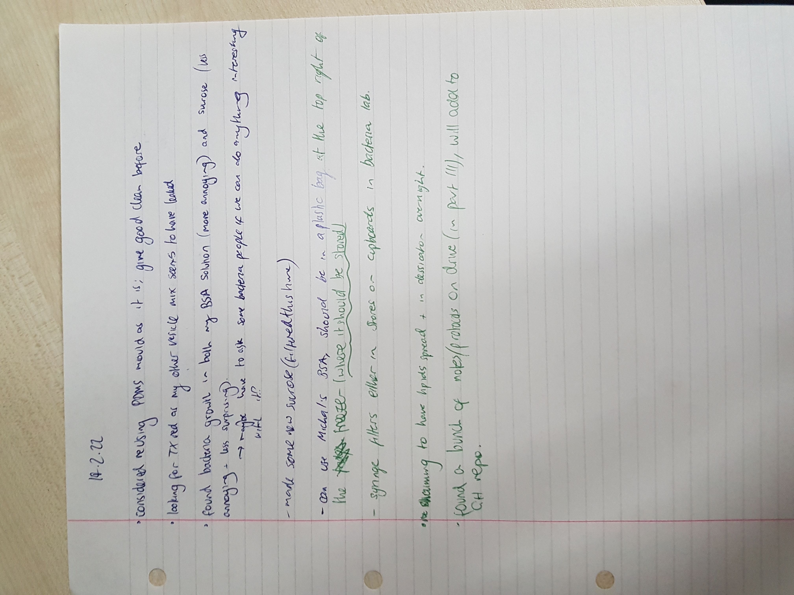
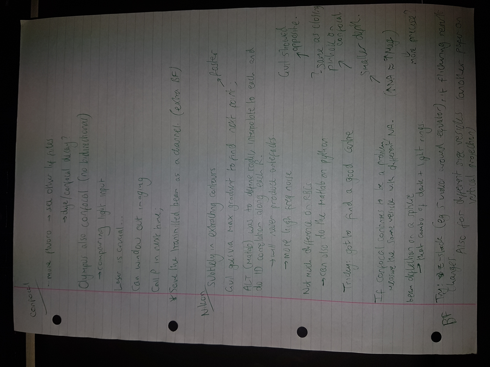
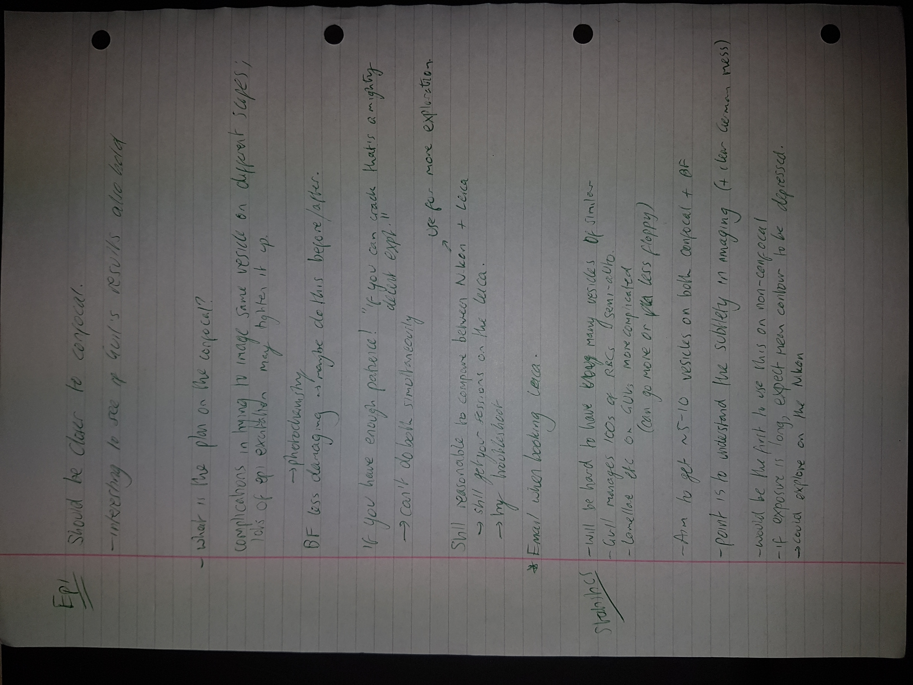
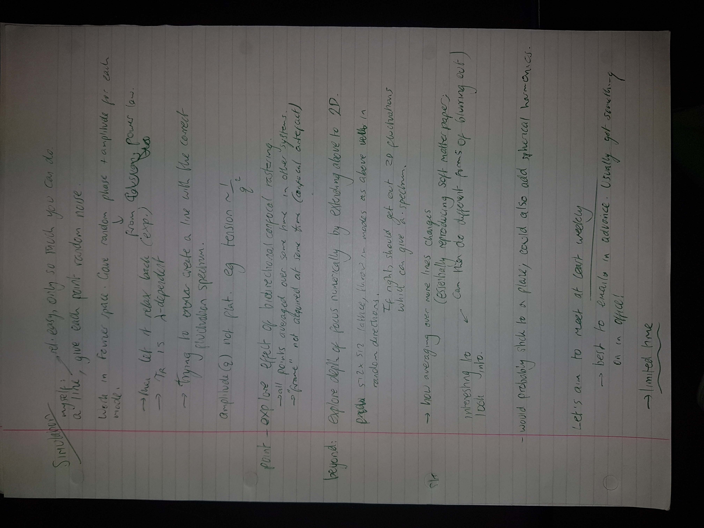
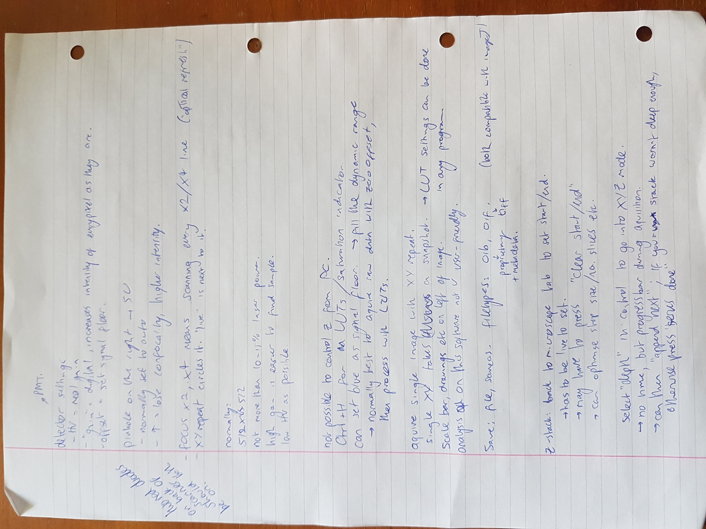
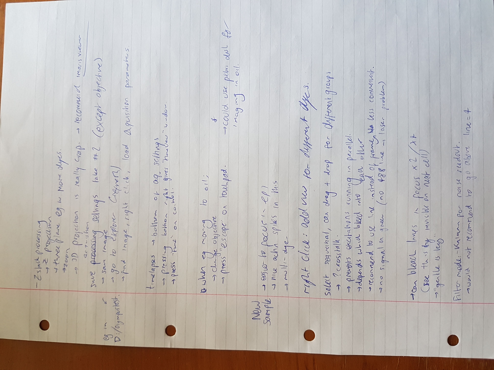

A general space for writing about things in the lab. Will likely be messy. Some (not super standard) abbreviations: MF = microfluidic, BF = bright field, EF = electroformation. Notes from Michaelmas were much less frequent.

### 27/10/21
- Had initial meeting with Pietro and Guil
- Pipetted 5uL of Texas Red of unknown concentration (due to evaporation) into remaining DOPC/Chloroform solution 
- Precision not needed here yet
- It turns out there was no remaining solution…
- Added 171uL of DOPC at 25mgmL (from freezer 04), although lost one drop while pipetting, into the same “jar” containing the new TR
- Added 892uL of chloroform (inside the foom hood) to it, vortexed, proceeded as usual. Will be interesting to see what the fluoro looks like (on pipetting, it does not look very pink…)
- Usual dessicator isn’t free! Used greasy one on top shelf.
Done for today; to do at some point:
- Get on the github, review project meeting just now
- Make up sucrose/glucose
- Get on the Nikons
- Pester Morten (DLW is a mess)
- Order TR, DOPC? For the more precise stuff
- Clean up my old stuff, review notes, set up lab notebook

### 1/11/21
- Microscope training with Jurij
- See BF_imaging protocol for notes

### 11/11/21
Chat with Guil about software he could send me, and how it works 
- Can add contours on movie files in either c++ (cpp-contour-tracker/track_movie.cpp) or python (moviereader/contour_tracker.py)
- Used to need a starting contour (which Guil has own temika script for - this is what generated that nice .txt file in his great example dataset), but should be able to get started by specifying own centre and first_point on the boundary
- In the c++ version the relevant part is around line 96; might be able to avoid some of the bs before by just inputting the right thing at the right time
- Can go through it together next week if struggling
- In the python version (probably in c++ too) the combo_tracker function should be able to track the vesicle as it moves throughout the movie file (essentially recentering it)
- Once have the contours, extracting the parameters should be easy
- Maybe go over some C++!

### 9/12/21
Chat with Guil about simulating the fluctuations
- First
- 	Can get shapes either by putting them in or by inputting tension, bending modulus etc
- 	Currently no time evolution - should be easy enough to put in through Langevin
- 	Inverse FT, superposing modes q>=2, 
- Optics - more mature
- 	Black box in extracting contours through the optics
- In guil’s (local) dirs: 
- 	Bead_optics/
- 	Battle_of_fitters/make_fake_cell_lib.py

### 14/12/21
- For the past week (since 6/12) I have been in the office every afternoon, working on simulations and analysis software and reading some good papers which I hadn’t come across before
- Today, obtained CAD files from viola (which are on the DLW computer anyway). These chips are to trap RBCs so would need scaling up for vesicles. This may save significant time and/or the need to contact other researchers with similar designs (which will inevitably be much slower)
- Another possibility for immobilisng vesicles is the surface biotin-avidin treatment - worth looking into if microfluidic trapping remains unavailable/obtainable, this can probably be done in a very simple serpentine channel with the required number of in/outlets
- Viola mentioned the need to passivate the channel before flushing other stuff down to avoid this annoying surface tension effects, even then I’m not sure how useful “my design” is. 
- I spent a while trying to find BSA, and not many people knew; Michal was able to help me with some crystals, so I made up a 1% BSA solution in DI water, although noted after that people also make it up in eg PBS or other neutral buffers. Turns out BSA solution is very foamy… unless I did something wrong
- I used this to try to passivate my old chip, but perhaps it was already too dirty for this to be successful, also the flow of fluids is still sub-optimal. Maybe should split up the channels going into the main array region as in Viola’s/Emma’s recent design
- Also tried to passivate other chips including serpentine channels, but these clearly had not been very well bonded/inlet holes punched too large/other related problems, which was frustrating
- So I cut some new ones (one inlet/outlet each, from a previous PDMS pour I had) and bonded them onto the same slide after cleaning the slide and PDMS surfaces with IPA. Sadly, the bonding did not work, despite using the same procedure as always (I don’t think anyone had changed the power setting but I’m not entirely sure what it is usually set on).
- This could be linked to the discussion overheard by Anna a few weeks ago regarding replacing the plasma bonder
Thoughts:
- Shame not to have done more chip experimentation last week, I did not think to ask around beyond Morten, who was the designated microfluidics person and was ill, hence I stayed in Cambridge an extra few days (planning to leave tomorrow)
- Quite tired now and even though end of term has been quite relaxed, I didn’t make as much project progress (at least not ESA wise) as I hoped
- Currently planning to return on the 10th of January, apparently by then a new microfluidics expert is joining the (group? Department? building?). Maybe I should come back a few days earlier to try hard to get this working prototype ready for 21st Jan (as requested by ESA).
- Exams ahh! 
Questions:
- What to do with old PDMS?
- How best to passivate and clean microfluidic channels?
- Is it worth emailing authors of vesicle-trapping papers to see if they can send any resources? (NB: check SI of good papers)
Other plans for holiday:
- Ensure lab notes are compiled and nicely documented (although not too nice)
- Continue to read papers in detail, alongside revision
- Get fluctuation analysis set up
- Get simulation software done
- Try to simulate microfluidic geometries
- Sort arduino syringe pump control

### 24/1/22
- Made vesicle sample to get back into it after the new year. Forgot to check which side of ITO conductive so dessicated the wrong side for an hour; decided the sample was not a particularly important one anyway and so smeared the other side and kept going. Convenient as only suitable confocal time is this afternoon and I want to go over it with Guil again.
- Have booked confocal 15:00-17:00, will make some notes on key things to do/look out for, hoping for good fluorescence but not necessarily getting data today (also need to check vesicle floppiness - get this from Guil's notes when we did this before)
- Ideally need to get some DLW time early this week to have a working prototype lab-on-a-chip for friday
- See handwritten page of notes for confocal time and usage. Will be useful as a reference for next time. Maybe ask Pietro for the matlab script for analysing confocal contours (different to BF ones)
- 

### 25/1/22
- Spent some time coding and thinking about ESA diffusion project alongside first day of lectures (which was fairly full)
- Spoke to Dean about training on the new microfluidics setup, should be able to do so next week

### 27/1/22
- Group meeting this afternoon. Aske presentation on post-transcriptional regulation in sRNA. Questions for Pietro:
  - MATLAB routine for confocal contour processing? Is this different to fluoro ones (and why? - check with Guil) >> Guil has the most recent ones
  - Are there any other BF/fluoro microscopes to check samples when tweezers room is in use/CL3? >> 0.34 or something (another Temika - ask Guil) and in the Tissue Culture room.
  - What is the plan with the Olympus?
- Have booked confocal for 16:30-17:30, post engineer service
- Plasma bonded PDMS cutout to cover slip for confocal imaging this afternoon, will use vesicle sample from monday, using 80uL of 400mM glucose and 20uL of vesicles produced with 300mM sucrose. 
- Confocal notes:
  - Managed to get it working after forgetting to turn on "visible" and wasting some time
  - Very noisy! Have I picked the correct laser?
  - Found that they are much more clearly visible when increasing the pinhole size
  - Also those at the "bottom" (which seems to be identifiable by some kind of dirt - see pictures) are much less mobile; I added some more in and noticed that these were moving quite rapidly, presumably down the density gradient until becoming stationary
  - Will have to play around with the detector settings on the right screen to reduce noise. At this level, it is difficult to tell how floppy the vesicles are; similarly they were made a few days ago and perhaps the glucose is a little old too and so the concentration imbalance might not be what I think it is
  - Scope sometimes has trouble resolving circular srtructures which I would have thought would be easily resolvable. Maybe this is a noise/intesity thing and the fact that they are simply smaller (paying with the zoom factor helped somewhat but this also meant they would move out of the frame more quickly)
  - xyt scan seems to work fine, will at some point need to work out how many frames I should scan over to get nice uncorrelated fluctuations
  - Required a phase correction of ~1.43 to avoid double images on the bidirectional scan (and it is unclear whether this made much qualitative difference to the images)
  - Changing input laser power didn't do much, nor did changing the PMT range (it seems as long as the peak and a decent bit up to FWHM is covered that will do)
  - took ~0.5GB data (most of which will not be useful), saved in D: and E: under "jsm89_temp_for_transfer" (can only save locally today as IT needs to reconnect it to the network)
- Also considered imaging in BF. Need to ask Jurij for account on that computer. Also need to go through changing the cameras with Guil (and why we have to do this...)

### 28/1/22
- Got account on Fedora PC in Leica room, will need to get Guil/Jurij to show me how to change the cameras over (and what the benefit of doing this is, as Jurij seemed a little confused, but it made some sense when I said I was doing flickering experiments)
  - NB the leica can already do some kind of BF transmission
- Imaged Monday's samples (again 80/20 glucose/vesicles) on the Nikon to refamiliarise with Fedora.
- Notes on BF:
  - Write up Jurij's step-by-step protocol for optimum imaging, as not sure if I have got it here (although it ended up being pretty clear, and temika is quite intuitive I find)
  - Struggled to see anything on 40x mag but was clear on 20x and 10x
  - The vesicles were not very floppy at all, perhaps for similar reasons as mentioned yesterday
  - The temika z-drive controls are very delayed and it seems more useful to sue the focus knob on the scope (without leaning on the optical table ideally)
  - Curious whether "eye" option (either on temika or the physical button) actually allows you to see through the eyepieces, as this did not seem to be the case today
  - There appear to be a few "burst vesicles" or something similar at the bottom of the sample (maybe also remnant oil after using it on the wet objective yesterday - should really get different sample holders. Perhaps also a thicker optical slide will also allow use of the 40x objective as in the past we were definitely more zoomed in on inidividual vesicles)
  - Once again the majority of the vesicles were nicely at the bottom of the glucose - could be relevant to ESA project ie whether they need to be "trapped" at all?
  - I also need to play around with the camera settings, similarly with leica imaging, as I remember in the apst it was easy to capture fewer frames
  -
- Attempted fluorescence (ie channel 1 illumination - remember to (physically?) change the FL block)
  - Could not quite get this to work, will have to double check which filter block and which LED to illuminate with (see eg spectra and notes on door)
  - Maybe the vesicles had somehow lost their fluorescence (although they were fluorescing on the confocal yesterday...)
  - Also changed the BF significantly on returning to that
  - Time for lectures, will have another go later if possible (although I think the room is booked for CL3 work for the rest of the afternoon)
- saved af ew images locally in data/

- Software afternoon
  - Reorganised directory structure on local laptop, cloning Guil's relevant github repos so I can pull/push any edits from either side
  - Working out how to package them (adding __init__ and setup files to them) so I don't have to keep adding to path (inspired by discussion with Kieran yesterday who has done similar for a local conda package. Note he also wrote a bash script to keep reinstalling the package once it has been edited)
  - After a lot of time I realised (through talking to Sasha) that simply adding the relevant folders to path through sys.path.append() is a much quicker (if shorter-term) way of doing it, thanks Sasha!
  - I now have a nice way of testing Guil's programs locally, and it works perfectly for the example data (surprise surprise). Python script currently takes a txt file containing the contour as input, which itself comes from the c++ contour tracker (I believe). Gonna look into this now
  - Managed to save a text file of the "results" using Guil's sample contour, which concluded a bending modulus of (264.829902+-10.955818)pNnm, a tension of (0.001486+-0.000166)pN/nm and a radius of 4010.748218nm for that particular sample. Also gave a bunch of other information including many decay times and associated errors for ~15 different modes. Will need to dive into this to see what's relevant (and how to neaten up the output) but happy that could work.
  - I have created a "jamie" branch on Guil's contour_analyzer repo to keep track of my own changes/documentation (could also just fork it but may be nice to merge later on)
  - Next up: generating my own contour text file from the c++
- NB: Aske had Will sort a few things on the office PC including downloading Ilastik for all users, could be worth exploring although maybe it only deals with single frames and hecne not as useful for my purposes.
- Note that running the analysis on the same contour multiple times gives the same results

### 31/1/22
- Continued with the c++, going down many rabbit holes but ultimately making some progress. No lectures today so spent most of 10am-17:30 on the screen.
- Pointers are confusing but at least I can now identify them and have a rough idea for how they're used.
- Forked Guil's code to my own branch and pulled locally, was a nice system and ended up compiling as required (can also use the makefile as I imagine it was intended)
- Spent a long time trying to change the header dependencies to tidy up the repo but got stuck and so had to revert back to an earlier commit and create a new branch
- Just need to set up the intitial contour now (as in track_contours.cpp) and it should work from there; have only been testing on Guil's sample data so far. Guil is happy to help so try not to go down too many more rabbit holes!

### 2/2/22
- Spoke to Rafia from the Rutherford Hub about Katie's refund request from September. Got to meet the team (incl Steve, Frank, ?Methia) and turns out they have an open door policy. Rafia has been there since October
- They found the request and apparently sorted it all out, but the "second approver" (who is someone else within the dept) never got round to approving it, hence no payment was ever made
- They have processed it again, usually such requests are bundled and sent off on Wednesdays (ie today) so this one will go out next Wednesday, and payment should be received between 11-14th of Feb.
- Now that we have done a trial run (hopefully successfully) we will process bigger claims in one go in the future, through the same expenses form as before.
- Microfluidics tomorrow, be in the lab for 9! (and then finish ~17, nicely in time for footy training)

### 3/2/22
- Microfluidics training with Dean and ?Chenyan (no Aske :( ). It can be quite difficult standing passively in that room for a few hours, but the next bit should be more interactive. It is very in-depth training (which is great) but I'm not yet sure if it really needs 2 full days!
- Notes:
  - SU8 is expensive (£600-1000 per 0.5L bottle)
  - But we may as well use it because it will degrade
  - Try and keep everything clean - always start with acetone, then eg IPA if appropriate
  - Didn't know we can do this on a glass slide, this is of course handy but then we don't get a nice "master" from which multiple devices can be produced
  - Laser writer levelling can be quite time-consuming, as can some of the baking steps (see the timings in the notes, when Dean sends them, which should hopefully be tomorrow)
  - SU8 20XX series has the notation that XX stands for the micron thickness for 3000rpm spin of duration (...), or something like that
  - Can see the 300micron "squares" which are the exposure units in the DLW, on the device, where it has been "stitched" together. In general, try to design devices so that fine structures can be contained within these. 
  - This morning we used spin process 7, although these are subject to editing by any user; SU8 prefers a two-spin process at low and then high speeds. Make sure the vaccum is greater than 25(au), otherwise it won't allow running!
  - First check coolant levels before opening DLW software
  - Can use in-house software for CAD style editing, it is more basic but make sure you save stuff if you do this (esp in case need to restart the software for whatever reason)
  - Ejecting/loading can be done either on the software or the hardware, software is probs better for logging, either way it gives a very Star-Trek vibe
  - Put the coated side of the substrate face down into the DLW
  - Don't put the spring side of the substrate holder down on a surface
  - Go slow when pipetting/pouring photoresist to prevent bubbles; will probably need to cut pipette tip (esp for more viscous ones)
  - Si wafers are in general better quality but much more expensive than glass slides. If we compared glass wafers and Si wafers, the Si ones are a similar price, despite being better quality, due to the electronics industry.
  -   Better = easier to see dust, less roughness (almost atomically smooth), can produce more things in one go (obviously)
  -   Similarities = both hard enough that cutting with razor is no problem, also defect size/overall quality both easily good enough for "microfluidics".
- Will try join the meeting this afternoon if I am not in the middle of something
- [meeting cancelled]

### 4/2/22
- Did PDMS, bonding and testing of new device between 11-15:30. Rate-limiting step was the 2 hour bake @60 degrees C.
- Mostly as before, with emphasis on cleaning around plasma bonding area, which I had not been too careful with previously
- My device was slightly leaky, we are unsure why. The 100um channels were also much easier to get flow through than the smaller ones, although it turned out the tubing and hole punch did not quite work.
I sadly also broke the plunger on the punching machine by pushing it down too fr, and this led to ~an hour delay (sorry Dean). Remember to always look perpendicular to the punching plane to avoid parallax! And the surfaces are not as hard as previous things I have punched on!!

### 7/2/22
- Did a lot of ESA electronics work yesterday, to show Nigel and co. our progress in a tangible manner.
- Katie has ordered reagents and is in charge of testing the reaction - I am really relying on her for this
- Wrote a simple script which could analyse sigmoidal curves by returning the gradient as a function of time, giving the initial and max rates. 
- Also currently deciding how best to characterise the saturation time - will talk to Pietro about this
- Plan for lab today: have booked DLW from 13:00-16:00, planning to print one of the Gennaio_attachment files that Viola sent me.
	- Also want to compare these to other works to show it's a better idea
	- Need to measure size (either post-production using profilometer or on software)
	- Expect ~100um channels, of a reasonable (50um?) depth, and smaller traps. Although this may be problematic for larger vesicle samples - reduce growth phase time?
	- For today only worth doing this on a single glass slide, as we are not yet interested in large scale production, and this may be more of a recall/test run for me
- At some point need to return to the EVOS with Timo, who I haven't spoken to for a while. Would be good to see what kind of scripting/remote control is possible with it

Tomorrow/later in the week:
- make some new vesicles, get some confocal/Temika time, and get more data
- continue c++ contour analysis
- spend more time on simulation code, should really have this done soon (and "out of the way")

Afternoon in the lab:
- All the phd students seem to have covid, office will be quiet for a while :( hopefully they can still make it to the dinner on the weekend!
- Forgot USB at home so could not smoothly transfer desired dxf from my laptop to DLW, and sadly I also could not find Viola's copy on the PC, so modified Dean's training one to include some traps. This ended up being a useful experience to get grips with the software (which is also faster than doing in on my laptop anyways).
- Cleaned the glass slide and did the SU8 spinning as best as I could remember, but I worry I got the heating/baking bits wrong.
-   I got a fresh slide, cleaned it with acetone and IPA, then left it at 65deg for a few mins. I then did the SU8 spin (program 7, hadn't been changed) and put the slide on at 200 for 10 mins, during which time I cleaned the spinner and turned off the vacuum etc. I also prepared the CAD during this time
-   Preparing the CAD took a little longer than 10mins so the slide with SU8 was left in the air for a while, at least the light was off.
-   Loaded, went through the calibration and sample prepation (which took me a few attempts but I reckon I've got the idea now), but could not "send to laser", I thought this was to do with the blocks that had been defined but eventually I found Dean who pointed out that I hadn't set the attributes (for future ref: chosoe "coarse" and set the second value to 800)
-   It then worked fine (and btw, the DLW does not expose any blocks that are empty)
- Now I am eating lunch and writing this. Will likely develop shortly and get the PDMS ready, then leave baking overnight? 
- Sadly the developmment did not work. I spoke to Peter while collecting a petri dish, and brought him down to show the idea of lithography/microfluidics (since he was waiting around for a while anyway). I didn't notice anything particularly unusual, but after the PGMEA dip, the IPA seemed to "congeal" the remaining photoresist off the substrate and it formed a weird substance in the dish. This continued when I tried to further develop it. My guess is that the pre-exposure baking steps did not work (which, on reflection the next day, I realised I had missed a longer water-desorption baking step after intial cleaning). 
- Either way, this was frustrating, but would give me an opportunity to go through it all again the next day, especially now that Dean had sent me the (draft) notes.

ESA meeting in the evening:
- More productive than expected, it was good to talk through why I had made certain decisions and whether alternatives were reasonable. 
- Progress has been made, and in theory with a good MF device and some good reaction tests from Katie we are almost good to go.
- Annoyingly campaign dates have changed againi and are currently pencilled in for 4-6th May. 
- Good, but mildly stressful, day (not sustainable)

### 8/2/22
- In the MF room at 08:30, quick clean and software ready after a good start to the morning. Was able to finish DLW exposure and clean ITO slides for electroformation pre 10am lecture. 
- After lecture, removed exposed slide and carried out development as detailed in protocol. Maybe a glass petri dish made a difference (yesterday I used a plastic one...)?
- Finished the final post-development bake slightly early (supposed to be 10 min at 200, I did more like 7.5 as I had overrun my booking slot slightly).
- Poured PDMS as in protocol, put in oven and ended up leaving it there for 2.5 hrs over lunch and QI lecture (should idaelly have been 2hrs but I don't think it is too important here). 
- Also did some electroformation during this time, ready by 15:10, with Roger wanting to do it after
- Cut and bonded new chip post-lecture and now writing this. On inspection it seems to have worked well; I don't have any tubing with me (or a huge amount of energy) and so will see whether I can trap the vesicles tomorrow morning, especially as the fluorescent Nikon is more available at that time. 
- NB when punching holes, I planned to use the mechanical device, but could not find the alan key needed to lower it towards the stage. Some of these logistic things would be nice to have in the drawers of the respective rooms.
- NBB left labcoat on hanger in Biochemistry lab when walking to waiting area, and will likely leave it there overnight. 

### 9/2/22
- Tested out new MF device using microscope in MF room. Worked well from a fluid flow point of view. Some of the trap squares have not come out quite right, but I realise that I should try passivating this structure before passing liquid through it as I am getting the same problems with the surface tension as in the last desing. Should also try make Vioa's design with the curved traps to see if that makes any difference.
- Tried to image vesicles in same scope but couldn't see anything (either the recently made ones or those from 2 weeks ago)

### 10/2/22
- Got in early on the Nikon microscope, I should still write up those notes as I spent a lot of time messing around with the hardware side of the illumination settings. Also I have yet to see a fluorescent signal for vesicles by myself - either this is a vesicles issue or an issue with my usage of the microscope
- To be fair, I could not clearly see vesicles in BF. I initally tried in a simple well (although without glucose) but I really think that cleaning the bottom of the glass slide or similar would be a good thing before next imaging attempt.
- I then viewed the MF channels, which at least gave me something to aim for, and they were easy to image (although still couldn't remove diffraction effects - see test images)
- I tried to inject some vesicles into the channels but this did not work from an imaging point of view (also directly from the syringe is perhaps not useful as may widen the inlet, and also seemed to give many bubbles, although this may also have been to do with the fact that there was stuf fin there from before. Need to work out best way to "clean" it)
- I also (still) do not seem to be able to control the z drive/focus by any means other than the actual buttons on the scope. 
- May try print new chip tomorrow, since the training lot will be mostly in the mechanics lab (although will maybe check this with Dean first)
- Also checked other computer and remembered that I forgot the capitals when setting my pw for it, tried to change it but the pw is too simple. Either way would be interesting to use the optical tweezers at some point (mainly for my own experience and interest, would be cool to see what they can do). It seems temika works in exactly the same way as on the Nikon computer.
- Also, tomorrow is Mattia's last day!
- NLO supo shortly (fisrt one of term)

### 11/2/22
- Continued coding, kept getting memory allocation issues and hence "segmentation fault (core dumped)"
- Found the source of the errors but not entirely sure what to do about it - given that this part of the code just needs to generate a text file with the initial contour, I could possibly do it a different way (eg in python) and then just `track_movie` with the movie file and the initial contour
- Left early (~14:30) to go and watch Lucien Hardy's QI seminar, then continued coding at home with Kieran but did not manage to pass any significant milestones

### 14/2/22

### 15/2/22
- Big tidy up of my digital records, have migrated all notes from the drive to Github
- Set up, modified and tested python scripts locally in order to generate an initial contour txt file; there are multiple examples of plotting contours which work so this should not be too hard, also much easier to work with both locally (at home) and at the office
- Spoke to Roger about locating DOPC and TR, these can both be found in Rini's box at the bottom of the freezer
- Made some (non-fluoro) vesicles with new sucrose solution made yesterday, cleaned vessel for making a new fluorescent lipid solution - Roger pointed out that the excat ratios are important for this work and that it would not be sensible to just add an arbitrary amount of TR into my (depleted) older lipid mixture
- Started playing around with lif files on ImageJ as I realie this is a whole different step to the movie file analysis which I been spending significant time on
- Tomorrow: 
- 	Make up lipid mixture
- 	Image this set of vesicles
- 	Make up BSA solution using Michal's stock
- 	Passivate MF
- 	Bring in electronics to discuss with Shash
- 	Ask Guil if he has any routines for analysing lif files

### 16/2/22
- Successful imaging on Nikon after finding notes from Jurij meeting - able to get it very clear
- 	 one thing to check is how to centre the filter at the top when you want to focus it on a certain part of your sample
- Now need to rememberhow to send the data to the Z drive from here; could write a script for it. 
- Also need to ask Guil what osmolarities we used in the past to get nice floppy stuff. These were not fluorescent so not too important for today anyway
- Also need to find corerct tubing size if I'm gonna have any chance of trapping the vesicles in the MF device, as injecting them in via syringe tubing today just led to leakage (mostly)

- Success in terms of remote connection from Nikon computers: you can run `ssh jsm89@sf1.bss.phy.private.cam.ac.uk` and get straight into the Z:/jsm89 directory
- Could create a local bash script which copies all movie files from a given date (eg using `scp *16Feb2022* jsm89@sf1.bss.phy.private.cam.ac.uk:~/data_remote/`) 
- Note the bigger files take a while, as expected!

### 21/2/22
- Made up fluorescent lipid solution and prepared slides for electroforming tomorrow
- Will try image on Nikon and maybe confocal if its free
- Get solution ratios from Guil! (I seem to remember 300/400mM being ok, but hasn't appeared so recently)

### 22/2/22
- nice palindrome date!
- made new glucose solution at 400mM
- successful fluoro (and BF) imaging of vesicles made with 300mM sucrose, put in imaging vessel with 1:9 ratio initially
- most of them were quite taught so I added 30uL of DI water to try and match the osmolarities slightly better (in the paper they used 197/200 sucrose/glucose, also in 1:9 imaging ratio)
- Nice to see the re-equilibration on adding the water
- Have also booked confocal but unless I get some nice floppy ones there's not much point (no reason I can't just persevere for floppy ones though)
- lots of brownian motion, fission products visible, good to know the fluoresence has worked
- NB on the EF today there were in the growth stage for 2h20 rather than the usual 2h, as the timings didn't quite work out with my lecture

- tbh the 1:9 ratio is still too densely packed for clear, individual imaging
- some were more floppy - have tried to give clear temika names to the files 
- definitely worth having a look through them and seeing if we can run any contour analysis
- also 40x objective seems like a good default, need to play around with camera mode each time (incl diff between fluoro and BF) but this will become more intuitive

### 23/2/22
Rough notes made while setting up new desktop environment in the office. Don't know why I didn't do this earlier... much nicer to work with than my laptop!
- It works! I compiled track_movie and it actually tracked something...
- Although it didn't seem to do the ending output I was expecting, and hasn't actually given me anything (isn't this where the text file is supposed to come from?)
- Update: it looks like it has updated the contour text file... maybe should compare this one to the previous one!
- Although it, and the movie it took as input, were in the directory above it; worth noting (probably to do with how I copied the file into the argument of the .exe)
- The two files are defo not identical, as one contained way more lines than the other. Not sure why, or how important this is...
- Got python files to run too and can now analyze_all for all movie files, with associated contour files, in a specified directory (basically as Guil had it - still need to initialise new contours to get those txt files!). Analysis working smoothly, will have to double check what kind of data we want for all of that.
- On local desktop VSCode setup I am gonna diverge from the likely git branch, since it works differently to how I expect from Linux, and reduce the number of files needed to clean it up. Can always upload to a separate git branch later.
- all the fns in have moved into `contour_fitter.py`
- have updated central repo README with new tasks

Also
- Spoke to Guil who provided me with the following extract from his lab book dated june 23rd 2021:
	- Imaged just after preparing. 10uL of 20mM sucrose vesicles + 210uL of 22mM glucose. Added glucose to chamber, then added vesicles to chamber, rather than pre-mixing. 
	- Floppiness and concentration were "perfect"
	- Same day we did 305mM glucose and 300mM sucrose, in same ratio. All extremely taut

### 24/2/22
Coding day, meeting with Pietro in the afternoon, after Rayleigh library book giveaway at 11am. See handwritten notes, Pietro meeting was very useful. 
Will aim to meet at least weekly for the next few weeks

### 25/2/22
- Finished biochemistry rota for the week, on it again next week (then likely never again)
- Made 20mM sucrose and 22mM glucose solutions from my stock for floppy vesicles next week
- Smeared lipids on slide for dessication over the weekend, ready to EF on monday
- Got Will to enable remote access to office desktop (PC1) but sadly it didn't seem to work from my laptop (some kind fo kerbolos authentication issue...). Will have to survive without the new setup for the weekend (which will mostly be reading and lecture work anyway!)

### 28/2/22
- EF of new, hopefully floppier vesicles
- sadly no microscopes were free so gonna come back tomorrow morning for get them on the confocal, trying a different laser.
- See Pietro's images!
- Also managed to get remote connection to PC1 over the weekend
- Quite tired, did some QS and QI, and watched the office handstand session!

### 1/3/22
- Big confocal morning, from 8:30-12:30 with an hour break for a lecture
- Defo feel more confident about it now; got much clearer images and the new vesicles from yesterday were good
- Auto gain is useful
- Tried different lasers (633 and 594), didn't seem to have a huge impact
- Tried HyD detector which gave the blue Pietro had, generally less noisy and easier to control too (took some images with both that and PMT active)
- Haven't worked out how to add BF channel at the same time (which I should be able to get "for free")
- Also noticed that zooming was useful in taking these images, as long as the vesicles are sufficiently stationary. Did then give the impression that they were much larger than they actually were though
- Need to get flickering analysis ready to go, then get a time where I can image on Leica and BF on the same day. Or get Guil etc to change the camera around for me
- See notes from Pietro meeting for what kind of data I should get (and label it as clearly as possible, at least write in here what happened on each day)
- Also plasma bonded a multi well onto a coverslip for more imaging opps

### 7/3/22
Presentation with other part IIIs and part IIs, see Pietro feedback (TODO)

### 8/3/22
Finally noting down the fluorescence settings that work (not sure why I haven't before)

(see screenshot of temika settings)
Made a few wells. 22mM glucose volume:
- 150
- 30
- 20
Currently imaging 2uL of vesicles in the 30uL glucose - far too dense (and maybe why the image was initially so saturated)
Some very nice floppy vesicles though, would be great to have these on all scopes
Objective: 40x (light blue)
Filter cube 6 (can be seen on microscope view) ---- Emma came in and had booked that scope (Have I got the tweezers wrong this whole time?). She
said that it's a nightmare to change all the settings between different optical modes, although you can just script it (Temika XML stuff). Also that
the fluorescence on the Nikon I had been using was considered dodgy recently, and that the other Nikon might be a better shout for measurements...

Either way took some images of good floppiness I think! Sadly it was very difficult to image the same stuff again on confocal...

Some thoughts on doing this:
- make the sample much more dilute, then there are fewer vesicles to choose  between
- Choose one near a certain corner of the sampling region (ie PDMS boundary) and bring the specimen in the same orientation to the next scope
- Shouldn't necessarily need a lot of time if the sample is good in the first place (and I don't spend ages faffing about with camera/illumination settings)

Other problems today:
- Wayyyy too dense (this was 2uL of vesicles in 30uL of glucose...)
- This naturally affects the physics - can't be having that
- The sample was super buddy today, nearly every large vesicle was crowded with shredded material on the inside, seemed like hence there were not that many floppy ones
- How exactly will data analysis on a z-stack work? If you are taking, say, 5 stacks in one series, are they one after another? (can test this). Then, do you have to skip to every 5th frame when doing a time-domain analysis of a particular z-height?

Good things:
- got lucky with using Roger's booked confocal time, tomorrow I could get the Nikon before ~11am and use Roger's afternoon confocal slot (but also have QI supo at 1600)
- Did get a nice variety of floppy stuff, really need to think about how to (a) record what I've taken and (b) how to proceed with analysing it asap (to see whether or not it is good enough)
- Really might be a good idea to get Pietro in here with me!

### 14/3/22 TODO
Olympus training with Chris Storey, + Pietro and Jack.
See pictures
Managed to image my vesicles but didn't take any meaningful data

### 18/3/22
Have missed doing these for a while, due to somewhat losing motivation/elevated stress towards the end of term.
Things to catch up on (notes wise): 
- Broke my PDMS splitter which is of course relevant to the EF process. Roger had a spare (but I did one run using a much thinner one which was just annoying when trying to retrieve the sample, and of course changes the sucrose levels in the vesicles too)
- Had a few good confocal days last week, need to analyse that data this week
- Still need to just initialise the contour and stop putting it off. After that the data analysis can run smoothly

Today:
- Came in around 12 from Brighton, via dos meeting
- Tried out the new Olympus. In general it is very intuitive and nice to use. 
- Issues:
	- Epi laser didn't seem to work again (as in the training). Not sure which one it is. Is there a HeNe that I missed?
	- Software didn't want to respond the first few times so had to restart the computer
	- BSS windows login doesn't work, so have to use msjf3 (see back of paper in green folder)
	- My hastily-made PDMS imaging well seems to clump the vesicles annoyingly in the edges/corners with some weird bubble structures. This also happened in the training on monday. Will likely have to make a better new one. 
	- Olympus still not connected to network so have to transfer data via hardware (and for some reason my USB is not recognised by PC1)
- After Olympus finally worked (confocal is nice, very tunable, more intuitive than leica) I had a sunny lunch walk
- Reading afternoon - found a nice recent paper on simulating RBC flucs (CGMD - Appshaw 2022) which lead me to try and get started with LAMMPS, but I realised reasonably quickly this was a deep rabbit hole. The paper cites some nice theory ones from Fu and Yuan. I've left those tabs opened and should maybe get them cited in my working report. 
- Went through Dimova 2020 paper again in detail (first time doing so in a while). They seem to have managed imaging single vesicles in both confocal and BF, and found no difference between them ("unlike as claimed by Rautu", which I don't quite understand, since I don't think Rautu claimed that). What they do, is talk about optical projections over a finite focal depth, but seem to dismiss it as the cause for measurement offset in fluctuation analysis. They seem to put it down to the effects of dyes, solutions, bleaching and other things. They do, which I find quite ncie, investigate a wide ranget of things, however I'm not entirely sure what their conclusions are as it seems they were almost out to disprove the findings of the Rautu paper. 
- Tried to access Brochard and Lennon 1975 paper pioneering the idea of fluctuation spectroscopy, but it is behind a paywall. 
- Found out that the behind modulus decreases rapidly near a phase transition. There is a lot of nice physics in GUVs!
- The 2002 paper by Hendriksen and Ipsen also seems relevant when considering gravity (although not entirely related to ESA work) but they also introduce a "correction factor" for the higher kappa in fluctuation analysis, stating that it is due to the lack of stretching in FS compared to other, mechanical methods. (taken from Dimova's 2014 review on how kappa are measured). 

Next week:
- Write some stuff over the weekend
- Initialise teh contours so data can be continuously analysed
- Work out what data would be good to take and take it! Haven't got much time left

### 21/3/22
- Started EF at 8am. During EF continued with sofware issues. Still not sure exactly where the contour is initialised. Will talk to Guil this afternoon
- Nikon free for most of the day
- Created new double well 
- Imaged 2uL of vesicles in 40uL of glucose (4uL vesicles in "shorter" well, as I felt an urge to add more for some reason, but this did not pay off)
- Might have to redo with less vesicles
- BUT seems like today I could image across a bunch of microscopes, since the olympus is not very booked
- Would really be good to have some data analysis today as I'm not sure (a) how long to take movies for, (b) if the camera settings are good enough, (c) what kind of metadata to collect...
- NB this was all on 20x 0.75 objective

- Coding from 11ish:
  - SPent a long time on initialising the contours using Guil's method of creating a seed file, from which creating the full contour tracking was easy enough.
  - A lot of debugging led to a problematic point, which I asked Guil about, and he essentially said you might as well skip it and go around it some other way
  - So instead of creating the seed file, we pass the center and one edge point of the desired vesicle as arguments into the executable
  - This then goes through the contour detection algorithm that Guil wrote (in the end with very few changes) and creates the _contour_full.txt file
  - From there you can run analyze_all.py as before and it spits out decay times, tension, bending modulus (in theory)
  - Decided to leave while it was still sunny as it had been a long day!

### 22/3/22
- In at 8:30 to get straight back onto the coding.
- More debugging, testing with Guil's sample RBC, big git cleanup for much cleaner version control and clarity in what's my own
- Around 10:40, managed to generate _contour_full.txt files for both Guil's RBC and for my own BF movie!!
- Great success!
- From here I could run analyze_all on them both to get some meaningful stuff out of it. Found out that the sys.path.append() things we have used for nicer imports require the script to be run from its home directory (so you couldn't, for example, run `python ../contour_analyzer/analyze_all.py .`)
- Analysis seemed to work in general, but some of the decay times were a bit weird (including with uncertainty being the same as the mean) and in my own movie it gave a bending modulus of 4 (compared to ~250 for the RBC). Also noticed that "extra_info" comes from the temika comments added when recording the movie in the first place - good to record things like temp, center, edge, etc. Could maybe even then automate the center/edge assignment procedure using temika metadata
- Currently seems the easy way to do this is hovering over desired point in imageJ
- Outlook for data collection:
  - High contract images
  - Isolated vesicles
  - Note down metadata in temika comments
  - Preferably vesicle centred as far as possible

- Plan (after speaking to Guil) for refinement:
  - Plot the power spectra
  - Plot the fitting in the spectra
  - Run `plot_contour_example.py` for some of my own data to see what looks nice (NB it works for Guil's RBC)
  - The power spectra decays towards some finite noise value, this is effectively a way of getting the "error" as defined in the fitting/analysis scripts
  - Compare bending moduli to literature values before proceeding blindly
  - Work out what is done over which frame
  - See what data I have that might be good to check out, and organise this to make it super easy in the future
  - Will soon have to make this work for the lif/oif files too!
  - Check Guil's recent work on the branches as he still seems to be active on them

- managed to get data from both temika computers, had to laboriously transfer via USB and/or data_remote (NB: seems USB stick either works on windows XOR linux)
- lots of the fluoro images do not seem to be working in ImageJ; similarly in python get "Invalid pixel mode: Must be 1 for MONO8, 2 for MONO16BE, and 3 for MONO16LE"
- Annoying as not much of the data so far (at least from non-confocal) seems very useful. 
- At least now I have a better idea about what I need to collect! - maybe ask Jurij about the imaging mode and make sure it's suitbale for subsequent analysis (could probably also check directly on temika PCs as they have ImageJ)
- Also asked Jurij about centering the fil-diaphragm, which can be done with the little grey screws (better on the right scope)
- And found a nice VSCode shortcut `Ctrl K, Ctrl 1` which folds in all the level one things (use J instead of 1 to fold them all out)
- NB in `moviereader`, running `contour_tracker.combo_tracker(movie, first_point, center)` with pytmk class imported gives a pythonic way of getting the contours for Guil's RBC, which works! Could I have just used this the whole time (although need to check how it saves). Did take a few minutes and annoyingly I did not save the output (although, maybe a large part of it was printing the result...)
- combo_tracker() supposedly corrects for vesicle drift too
- TODO: try out something with .gitignore, it sounds easy enough and may solve some

### 23/2/22
First objective 20X0.75 on temika
Managed to image the same vesicle on both Nikon and Olympus, each with 2 different objectives
Seemed to be fairly bleached by the time we were done
Analysis wise, maybe easiest is to convert confocal files to TIF in ImageJ and then work from there 
NB imagej has loads of useful edge detection, prcoessing features which might be useful - had a play around in the evening
Also note that for fluoro images, the contour is the brightest point (ie max intenstiy) whereas for BF Guil's algorithm is looking for the max gradient (ie going from "bright" to "dark", depending on how the contrast is set up)
This needs to be changed (or at least an option created) in the contour detection. Could look into the matlab code that Viola has been using (but that requires using matlab...)
Easiest (in an ideal world) would be to have an ImageJ plugin for lfickering analysis!

### 24/3/22
- Tried again, sample less good this time.
- Will still have a look and analyse it!
- Show pietro after group meeting later
- And redo EF to try again tomorrow (this early morning thing is working nciely)
- This was using 40uL glucose, 0.5uL vesicles; yesterday was 1uL vesicles

For_Pietro_24Feb:
To show:
- lif images on ImageJ 
    - how to make less noisy?
    - haven't worked on analysing these yet
    - possibly wrong laser
- BF images (ImageJ plugin not working here) via, eg load.py or save_image.py
    - the old ones are more floppy but less high quality, the newer ones are less floppy
    - currently only single frames annoyingly
- plot_contour_example.py using Guil's sample data
- analyze_all.py which returns a text file of results once the movies and their associated contours are available
- lab notes and others on GH (should share this repo)
    - anything I should add?

Questions:
- simulation aspect
- plan for Olympus?
- how much should I fit exactly the prescription in the paper (eg 197/200 in 1:9 vs 20/22 in 1:21)
- what to look out for in "how many frames"

Pietro meeting notes (pre-childcare afternoon):
- Get BF images to work
- Some subset of imaging the same vesicle on different techniques and objectives will be amazing
- Watch the 12-bit stuff, ImageJ doesn't like it
- Ask Jurij about .multiled
- Check power spectra
- Algortihm shouldn't be too hard to modify for fluoro images. it's a few lines of code that need troubleshooting. (see matlab code) Can effecitvely choose a centre (which may need a couple of iterations), then define a polar coord system. For each \theta (which you can decide how to break the pixels up into, maybe 360 degrees, but note that we may not need to resolve the finer modes up to a certain point) you can send a "ray" out, and effectively get an intensity profile as a function of r. Something about for each pixel, weighting it relative to the neighbouring pixels as a function of the distance to them; then you need to fit something to the maximum either using a Gaussian, parabola, whatever really. Then repeat over all theta, and the frame is done. Then repeat for all frames to give the total contour. 
- Note down things like pixel to micron ratio (done automatically in confocal), also on Nikon whether the "magnify" lever is used or not (as this is not recorded anywwehre). THIS CAN AFFECT THE SCALING!
- The fluoro images from yesterday are very nice! -perhaps need to be a bit more floppy (can only really know with the power spectrum)
- Could make more floppy by:
  - Increasing osmolar pressure by adding mroe sugar outside
  - Cool down (30mins in the fridge) then allow to warm up (30 mins at RTP) then image - could be a useful protocol
- Will try again with fresh sample tomorrow. NB scanning rate on Olympus may not be good enough (Leica, with resonant scanner, should be better; as discussed, ideal for fast dynamics is a spinning disk). Also not really much point keeping the BF channel on Olympus as it really sin't optimised for it and not gonna get much meaningful data out of it
- Can also get calibration slide from eg Harry, Sam, Jurij for Nikon pixel:micron scaling.

TODO:
- send BF images from today when we can see them (eg on python) - either multiled from yesterday or Nikon ones frmo today (RAW12)
- Send example power spectrum (although currently will only get for BF, need to modiy software so that it works for fluoro too)
- Chase up contracts, ESA is sending emails!

Imaging with Michal:
- Mode 7, MONO16
- Use XML scripts! Will save a lot of time in the future
- on Display settings: CLICK AUTOMATIC PIXEL RANGE (this is why MONO16 was always so bright)
- Also, RAW8<>MONO8, pretty much. Jurij says don't bother using 12-bit stuff as most standard stuff will not decode it, and it gives the same info as 16-bit but with smaller bandwidth. RAW8 for high fps, MONO16 for high quality images
- Passivate the glass slide! It's lucky you have seen anything
- PDMS imaging well should be fine
- Make some new glucose - normally only use it within about a week
- These things will contribute to much less dirty samples and stuff
- See example image settings for decent contrast:

- Could also try high sugar concs for better contrast (haven't tried this in a while - consider % osmolarity mismatch)
- Also press "focus" button on scope, then zoom in - this will catch you when it is within acceptable focus, without hitting the sample, and allow you to use the up/down knob next to the stage mover (which has a satisfying noise)
- Also seems that L80 (ie the bottom camera) is the better one to use
- Also LED2 instead of LED0 on the BF channel?

Imaging with Erika:
- lots of rubbish vesicles, lots of dirt, maybe they have finally decided that passivation is required
- should probably filter the glucose etc
- should probably also not use old sucrose vesicles with new glucose
- Also tried one well where the glucose/vesicles were pre-mixed in an eppendorf tube with the same ratio as this morning (but could not see a clear difference as the sample was a bit trash anyway)
- much higher contrast though! Pixel range + adjusting frame rate (also physically check filter cubes) is the key:

### 25/3/22
- Tried new batch of vesicles again and sadly it once again was not great.
- Also worked on getting a temika xml script going to save my illumination/camera settings but I didn't end up having much microscope time so did not succeed
- Prepared for next EF
- Left around 15:00 with Ollie who had just submitted his final report! Nice sunny day for a BBQ

### 27/3/22
- Made it in on Sunday after footy training, mainly to continue trying the xml scripts and to EF a 300mM sample for tomorrow
- Made some progress with the xml, the interface is extremely nice but I kept getting "errors"
- Tried on both 0.26 computers but the non-tweezers one was not fancying temika today (when I tried to restart temika it said "bind: address already in use"), and the tweezers one eventually did not connect to the camera (which seemed to be the source of most of my errors, although the illumination also did not work as I had expected it to), so I restarted that computer and decided to leave once my EF was done

### 28/3/22
- Neither 0.26 computers working this morning, and where is Jurij? He is always in earlier! :(
- Have got next sample in vacuum for EF, but hoping this does not present a major problem, maybe I won't be able to get any data today. In which case: make sure the analysis routine is ready to go!
- Also need to submit claims to UKSA!
- New intern in the group - Clara from France

Computers fixed so managed afternoon imaging from 2-5pm:
- All imaging done using 300mM vesicles in 303mM glucose, and on the Nikon the 1.5x magnifier was OFF
- Viola was helpful in pointing out a few things, for fluoro should maximise gain and shutter and always use MONO16
- Can see the filter cube number on the rotor under the cube
- Can keep the filter in place for BF with the right camera settings etc
- XML scripts also seemed to work earlier once there were no apparent hardware issues - should be able to create some nice ones of these
- Find the automatic pixel range thing by clicking on the frame 0 section in display settings
- Start with as low illumination as possible, remember to do the whole condenser adjustment stuff
- Managed 3 or 4 different vesicles across the 20,40X objectives on both Nikon and Olympus (which, by the way, takes 0.065s for each frame, ie fps >~10, which may or may not be good enough?)
- New sample and imaging felt good, might try again tomorrow for more data!
- Code for Malaria interlock: 8126

IMPORTANT: All temika data was copied, so I thought, into cicutagroup, although it did seem a bit weird. I created a dir called jsm89_data_28_march. Then came back for it, relogged onto PC, and it WAS still there. But, on mounting cicutagroup through cifs, I could no longer access this "unmounted" version and so could not transfer the data. Looks like you need to be superuser to unmount (tried umount on the terminal and through gui). ASK JURIJ TOMORROW - hoping it will just be there if unmounted

- Plan for tomorrow:
	- Try the cooling/rewarming thing to "reset" floppiness
	- Image on Nikon again, modify XML script
	- Get data specifcially for larger vesicles
  - + get Will to install MATLAB on PC1?
  - Talk to Jurij about data recovery as above; also ask if the movie info can be recovered from the .multiled files (which some have saved as)
- For XML scripts: settings after today (esp. after talking to Viola) are pasted below

Coding in the evening (until ~19:30):
- neatened plot_contour_example and got it to work on floppy.11Nov2021_11.20.50.movie! This was after generating its contours using track_movie!! Shame it's not the nicest sample as the contour is a bit dodgy but still! Check this out!

### 29/3/22
- Jurij again not in the morning so will have to wait to ask the above
- XML script working perfectly as I intended :)
- Sample is a bit dead at this point so started new EF with 300mM sucrose
- Tried preparing sample with extra cover slip on top, unsure if this has made any significant difference other than stopping evaporation (which isn't very fast, but overnight seems to have mostly gone so it's definitely there - and can then of course affect osmolarity)
- Tried the fridge technique, put in upstairs for 30 mins (after already preparing in PDMS well) and then imaged it again for ~30 mins after
	- Didn't notice a significant difference really, still the same features in that the wobbly ones are all shedding in some way or another
	- Ask Pietro/Guil if these are worth imaging
	- If contour algorithm is good enough, can also pick relatively taught ones where the fluctuations are just visible - test! Also might make it easier to image the larger ones

Imaging with older sample:
- found a nice vesicle on nikon while waiting for EF, got it on 20x and 40x (note use of 1.5mag, see temika header)
- Found something else on confocal which was semi nice but had a weird BF, turned out to be the wrong one (forgot about the confocal asymmetry)
- Went back and found v1 again, which had a very nice BF channel when using high illumination, which would be nice (especially if we had epi going too) but contributes to bleaching somewhat (which isn't ideal). 
- Did manage to image it with low intensity, high voltage, high offset really nicely (almost a perfect edge, save for a few artefacts)
- NEED TO KNOW: are the olympus files good enough(ie high enough fps, max = 1/0.065) and am I scanning for long enough (currently taking 100 frames, which feels short - check mode decay times etc). Would be a shame to have to take all the confocal data again. ANALYSE!

New sample:
- EF growth stage for 2h40 instead of the usual 2h, wanted to see if we get bigger, floppier stuff
- Was then going to image it but was happy to let Roger use it instead, I'll be there again tomorrow morning!
- Finished Hex cleaning step

Afternoon:
- Installed matlab on PC1, turns out those flickering codes (however old they are - found one I think? identical file on github `lp389` from 6 years ago... https://github.com/lp389/VesEquatorFlickeringCodes) work!!
- So ran a few of those to test it out, seems to be ok for fluoro and BF, and supposedly with AVI/LIF filetypes too. 
- Will go over it tomorrow with Viola who has a slightly updated version
- Note this is different to Guil's algorithm. Seems to give some decent power spectra but NEED TO COMPARE BETWEEN THEM
- Not sure about Olympus files, will see what we should transfer them into...

### 30/3/22
Good early chat with Jurij which solved all of my problems. 
- Made pull request to Temika-guide for troubleshooting issues I feel confident to share (not sure if anyone reads it anymore anyway)
- In case of hard reboot: the dnatweezers computer (currently on the left in 0.26) can be done with a hard reboot, just long press the power button until everything shuts down and then start it up again. The cellimager PC (on the right) can be done similarly, but it may help to take the USB cable with foil on at the back out before trying to turn it on again. 

TODO - rest of day

### 31/3/22
EF with 20mM vesicles from 7:40, did some nonlinear optics questions while waiting, managed to get scopes for straight after (although engineer is doing PAT tests at some point)
- New well, put in 34uL glucose and 2uL vesicles, then tried to put on a coverslip but realised doing it in this way just draws it all out of the well by surface tension, which was a bit annoying
- proceeded with imaging anyway, at first the sample was lovely but very quickly became one of the worst (took some great "fail" images though). Lots of tethers, "coronas", movement etc. Did get one nice one but could not find on confocal, then tried to find again on Nikon and also unsuccessful
- V2 was aspherical and I caught fission footage
- V3 was good but took too long so once done with Nikon it had many internal babies
- Got a few more but hard to find on confocal... overall 21GB of Nikon data from today! Talk to Viola about analysis later
- Forgot to get confocal data but will do this tomorrow

Viola pm chat about matlab flickering codes
- set pixel:micron ratio, temperature, etc. WIDTH can be varied if detection doesn't work on the first few tries. Try readjusting centre and first point. Not entirely sure what changing fluo from false to true does
- If brightfield, want dark-light-dark at the membrane; pick just inside the light region. If epi, choose brightest point on "edge" ie furthest from centre
- Set up three different scripts, one for each imaging mode so you don't have to change anything
- Sent me a lot of useful stuff; clean up the dir and add the new one, also she said she would in addition send a code to correct for translation over time
- Play with which modes we want to fit (may be able to do this faster without redoing the whole contour, simply the spectrum analysis)
- Guil's is "state of the art", at least for RBCs. Compare the power spectra with both of them
- Can save any file as AVI through ImageJ and then run it in the new code
- Some of the recent data is really nicely detected on the matlab
- Note also the (dd vs rr) correction for non-spherical geometries where, instead of subtracting a circlular contour, you find the fluctuation by subtracting the mean contour over all frames
- The "white interior" analysis she showed me was super fast!
- Optimise all these things before you just whack it on overnight!
- Available tomorrow/next week to see how it's going, maybe send her one or two example data to see how she goes with it

TODO: compare decent spectra from both Guil's and Viola's over a suitable range, and implement codes for each of BF, epi, confocal (incl setup for AVIs, and find a smooth way of converting to this)
ALSO: my current olympus file naming system is trash and needs improving. Or just switch to the leica with the resonant scanner

### 1/4/22
- Someone else has booked the Olympus - is this some kind of April fools joke?
- Bit tired after swim this morning, don't plan to do much lab work other than get previous Olympus data, and prepare slide in vacuum maybe for EF on sunday?
- Computational tasks outlined above - also make progress on write up! This will help when talking through the data with other people!
- QI seminar on quantum biology at 3pm already planned as my break, plus I won't be staying too late today (after being in from 07:30-21:00 yesterday...) as am meeting people in College for dinner at 6pm

- Did some writing and formatting (a bit too much formatting really, but I'm happy with the current outcome)
- Spoke to Chris in the evening about vectorising the images in latex, they do look really nice but it's not a great use of time (especially for my figures which aren't so easy to vectorise?)
- The "mechanics of the cell" book has a nice derivation of the fluctuation modes!

### 3/4/22
- Didn't do much project work over the weekend other than coming in to EF today, while waiting I went on a jog and picked up an Agatha Christie book in Coton so read that for a while
- Was planning to use the DLW but was unsure if Max's stuff (who had booked before me) was finished, so will maybe try and get on it tomorrow!

- Right now: looking to find the .oib metadata, to see if it has a micron per pixel value (otherwise will go and check on the hardware/manual)
- Success, see for example `oifread.py` (and thanks to the person who wrote the oiffile py lib)
- During exploration I came across the open microscopy environment, seems cool

### 4/4/22

DLW:
- Tried it as I was tired - maybe not the best idea in terms of results...
- Most of the "prep" was legit. I used the same glass slide that I had previously tried and just went on the back - not sure if this is inherently bad but I wasn't going to use the other side again so why not. Cleaned it and water-desorbed as usual.
- Used spin process 7 again (as in the training) without reallyyyy checking if it had changed, although it looked similar. This was with SU8 2010 from Dean's little bottle in the flammable cupboard. May have been a few bubbles on the substrate surface after coating so this was probably not ideal. 
- Soft bake was approx correct! Temperatures not exact but I think they were fine. Did for ~1min at 65n and ~1min at 95 (defo need to check my thickness though again in case this is completely off).
- Laser writer thing worked well; I ended up using just one of the blocks from "31 genn.vet". It's been a while since I've done CAD stuff but this looked like what I was after, and after remembering to set the xposure settings the preview looked as I expected. 
- I didn't take tooo much time on the levelling bit, also noticing that the instructions/tips for doing this are not on Dean's handout. However from memory I think I did it correctly and certainly after exposure I could see the correct pattern by eye at least. Only took about 5 mins so I just waited and got the next bit setup..
- Post exposure bake was nominal.
- Once again I was caught out with the plastic petri dish with does not agree with PGMEA. Fine for IPA though. Used the glass one left there for the PGMEA, and exposed initially for 30s. This was clearly not enough, so did for about another 15sec. The IPA was clean so I rinsed the subtrate and dried it - sadly did not see much of the exposed structure left. Proceeded to bake and write these notes but I'm not expecting much from that particular run...

Thoughts:
- computer is now connected to the wifi, although not the BSS network space so likely still use the USB going forward (although at least can maybe remote connect to others if I have forgotten it, or logon to Autodesk online to retrieve my stuff)
- If I'm only after a proof-of-principle, this could surely be sped up by having eg Aske or me doing the process and just combining our CAD designs onto the same substrate? Obviously only if they are similar resolution, requiring the same SU8, spinning, baking, etc... BUT after that it's just a matter of pouring on PDMS and then cutting out each relevant bit. I guess it's then not "your own" and maybe that person would be away on a certain day or something, but in theory it's no extra effort for someone other than maybe waiting longer for the expousre.
- Defo need to re-read the thickess/baking time protocols and do it a bit more officially next time... at least the general idea is still there. Also have another look at the lab notes from the training and subsequent attempts!
- Would like to have another go with the inlet punching drill...
- Can't remember what you're supposed to do with the waste chemicals in the glass bowl! - checked with Viola - in the waste bottle in cupboard as expected...
- Actually, on microscope inspection, the small bit that has exposed properly is very very nice. Shme it's only about 1 tenth of the planned structure, not sure if it is still PDMS workable... nice traps though and would certainly like to try this one again. Also: the glass slide is extremely dirty...

### 5/4/22
- Tried morning imaging with vesicles from sunday, in 1:20 dilution, but they were sadly rubbish. 
- The one time the leica is not overbooked!
- So i EF again, due off at ~14:00
- In the meantime, sorted some citations, read some papers, added a bit to report. Should try and see Pietro today as I missed him yesterday, also ask Tim about that laptop that needs disposal...

Afternoon imaging:
- in Nikon room with Kate, my vesicles weren't showing up for some reason (on the non-tweezers).
- Did get to see the tweezers in action, they are so cool!! It's like a video game!
- The non-tweezers epi had an extremely narrow field of view today... don't think that is normal really. Viola had a look and couldn't do much, I asked Sam to do the alignment thing which at first seemed to be the issue but then didn't actually change anything... at least I now know how that's done!
- More leica time, and I found out the epi on it is amazing (at least for spotting good vesicles). Maybe also felt great in comparions to the today rubbish Nikon
- Took some 10k frame images on Leica with both 20x and 40x dry objectives, sadly the vesicle sample (that I just prepared) still wasn't great... time for new solutions!!
- Saved 2x .lif files in nscratch
- TODO: nscratch was not big enough for them all so I need to go back and get them from the computer via usb, if they are still there....

### 6/4/22
- Did some lecture work in the morning
- Came in the afternoon primarily for microfluidics (+ to sign various cards for the leavers!)
- Dean was just finishing off so I only got into microfluidics at 15:30, also the card access has been changed and mine hasn't yet been updated...#
- in the meantime made some new 20/22 mM solutions, could have been contributing to rubbish sample in the last few days, and prepared next slide for EF (in vacuum now)
- Baked + span based on SU8 2010, 20mm thickness. Saved modified design as "jamie_DLW.VET". Proceeded with two cuts, then realised that would take a few hours, and originally it was my intention to stay in the room during exposure (as doing a similar design on coarse mode the other day took ~10 mins) and this would avoid access problems, however even for only one pattern doing it on fine meant it would take more like 1h30 and I did not feel like sitting in there for that time (without good wifi etc so couldn't have done much useful). So am now waiting to see if anyone with access will be around by 18:00 but if not, I'll just have to come and get it tomorrow when someone will be (eg Tim). 
- NB levelling procedure was super dodgy today and I must have spent a good 20 mins trying to get it to work, in the end I effectively just ignored it so if the exposure doesn't work out this is certainly a strong candidate as to why!
- NB have also left USB plugged in!!

### 7/4/22
Today:
- EF? Then imaging? - Rini at some point wanted to see the EF again. Leica is free frmo 18:30 today! And I have no evening plans. So EF later...
- Get slide out of laser writer and pour some PDMS on it (use a smaller plastic petri dish for that one? Although may break again). Baking takes ~ 2hrs + prep time - maybe can get the PDMS going and then do the post exposure bake/deevlopment?
- Depends on card acces situation (which is currently unclear... Need to resend the original form... which has expired...)

Rest of day:
- did exactly as above as my card access was fine

### 8/4/22
TODO: Pietro meeting (and revision)
- first "in person" group meeting for Viola's actual last day
- then Pietro cycled over to speak to me and her
- See handwritten notes for that meeting (most of the day prior to this was lecture work)

### 9/4/22
Came into POM to get slide under vacuum. Looks like Leica is free on Monday but not otherwise next week...
Thought: are my lipids spending ***too*** long under vacuum? Could this be degrading the samples somehow?

### 11/4/22
Plan:
- send Pietro copy of working report
- Go and get Leica, Olympus specs
- Find out Nikon specs
- Calibrate Nikon for different objectives and 1.5x toggle using the slides - this is important in data analysis
- Check TR filter specs in Nikon room (picture the stuff on the door)

Day:
- spent morning on above plan and writing report; pretty much finished the introduction and background, as well as experimental methods
- Spoke to Guil and Roger about various things. Hoping to write the analysis and software part soon. 
- Put sample on for EF before speaking to Kieran and Chris about QI papers
- Did some NLO questions, including trying to work out exactly what "parametric" means in this context
- spent the evening on the Leica, trying different pinhole sizes on the same vesicle etc, not too much going back and forth between rooms this time. 
- Did convince myself that re-pipetting vesicles into the well makes for a much nicer sample (in that a far higher proportion of them are "isolated"). Quite nice to see them equilibrating after they've just gone in.
- Also probably spent too much time looking at the laser (with the leica in epi mode) and I should watch out...
- Pietro sent some comments back in the afternoon which I am happy with! Now just got to get to work on the data...

### 12/4/22
While waiting for Leica availablility I found a "Starlight calibration slide" in the drawer of the Nikon room. Calibration imaging procedure:
- Order of objectives: 20x0.75, 40x0.95, 10x0.45, 60x1.20 (all without oil, which I think is correct for the 60!)
- For each objective, did the aperture/fd settings (NB for 10x it was very nice to see the aperture clearly!)
- found the same set of 3 spheres, which are supposedly 6um diameter, and focused on them for each different image, using the extra fine focus knob. 
- Imaged a "big", "middle" and "small" frame for each objective and version of Mag ON or OFF, except for the 40x where there is no "big" and the 60x where the mag just stayed off. 
- NB the focus on the 60x did not seem as nice, and the light distribution on the 10x was not very uniform.
- In terms of getting pixel:micron out of these, I expect I could find the diameters in pixels using eg ImageJ. Would expect them to be the same for all frame sizes I think, but different across objectives and magnifications. 
- Try to estimate the uncertainty each time!
- 

Leica time:
- took some images of varying pinhole size on the same vesicle
- took some trying to vary the objective - did notice that overall the Leica images are only any good with an oil objective, which (a) makes it harder to try different NA and (b) makes it harder to compare vesicles across scopes. Again I ask, why we don't just attach a different camera to the leica and use the temika functionality as this would make life a lot easier. This week may be good as the Nikon (and the Leica) are barely booked...
- Got a couple of vesicles which I think I also then got on the Nikons, but we will have to see. My default Nikon objective is the 20x0.75NA which is obviously different to those on the Leica, so might affect direct comparison between the two. 
- Once again, the Nikon epi images weren't great, will still try and analyse them!
- Also, it seems that files of size >~4.2GB don't want to be copied onto my USB, which is really annoying for the ~4 lif files I need to get across to cicutagroup/jsm89...

Small microfluidics progress:
- was wondering whether to try and use the DLW again today for the same design; then realised I have an old Si wafer version of it!
- So cut out the PDMS, bonded it happily to a slide, and... realised I had forgotten to punch the inlet holes
- Either way, checked it on the scope (10x), and it looked pretty good but not great. Lots of gaps and stuff. Unclear if that's in the bonding or the exposure in the Si. At least can hope one on that wafer is good (or that it was the bonding) and take it to Timo later in the week for the EVOS!
- See microfluidics_latest.movie (which is 11.2GB... defo not needed) for a quick film of it, might be good for presentation.

### 13/4/22
Attempted to 3D print another, slightly modified syringe pump
- made the "arm" narrower and removed the "pole" from the base, using blender on PC1
- then installed Ultimaker Cura on PC1 (can't remember when I last used this...) and used the following settings:

- didn't work out too well, it is significantly lighter than last time and the arm completely failed. Might be to do with how I "narrowed" it (which was using the extend tool on blender... which tbh is a pain)
- Otherwise was a QI day 

### 14/4/22
Reprinted the base with the following settings, which is due to take ~2h45

Wanted to try out the MF chip that I bonded just before leaving yesterday evening, punched with the green 0.75 manual puncher, which on eye inspection looked good. It was certainly better than the prev one in that there was a channel going the whole way through, but the traps were still "covered" and I still don't know if this is a bonding issue or a DLW issue. 
- When I tried to pass fluid through it, however, it still leaked out of the inlet hole. I tried a few different things, incl placing a bigger tube directly into theinlet, and placing the luer needle of the syringe directly in too. 
- Even tried to superglue (thanks Harry) the bigger tube in to create a seal, but maybe I then tried too quickly as it still found a way out!
- Am now printing the same design but much bigger, which I'm hoping will (a) make the traps better, (b) maybe be more appropriate for my sizes anyway, (c) be much easier to pass fluid through. Post-spin bake: 1min at 65, 3min at 95. 

NB: need to get the recent LIF files from my USB and from the actual PC, into cicutagroup.... 
Plan: 
- stick with Guil's code, which is on the whole working fine (and nicer to use than Matlab). 
- Show some things about it, like perturbing the starting points having no effect on the final contour. 
- Modify it for epi/confocal. Should really not be too hard.
- Analyze what I've got, then take more data accordingly, but keep that simple (which has been much bettter recently).

### Easter weekend
- Came in on Friday to try and convert the matlab contours into a format analysable by the python routine. Realised this was not trivial due to the different detection algorithms. Had a good think about Guil's drafts and responded to him, and read through the "mechanics of the cell" chapter again over lunch before returning it to the library (in favour of Zoller's QS book for revision purposes.)
- Took out the latest MF chip from laser writer, and did the post-exposure treatment. Today I found out that you can blow the developed pattern off the substrate!!! Of the two I had lying there, one just blew off when I dried it ahead of the long hard bake. The other also moved, so I don't know how successfully I managed to place it back down. 
- Put it in for PDMS treatment and the weighing scale was not turning on, so I eyeballed it using tablespoons (approx 3 large ones of PDMS, and roughly half one of curing agent) and put it in the oven. 2hrs later it still seemed quite soft... have left it to cool to see if that always happens, otherwise I must have got the proportions wrong. Will more baking save it?
- Did some coding on Friday night, Saturday was almost exclusively lecture work, with my laptop showing signs of unhappiness (probably had to restart it due to freezing about 7 times...)
- Sunday morning was planned to implement Pietro's corrections to the report and type up the section on contour analysis, however my laptop really wasn't having any of it. I could not get it to work for more than 10 minutes at a time so decided to download an exam paper on my phone and try to do that instead, although realising that I need to back up the important things on my laptop that I'll need for the next few months
- In the evening managed to get it to work (unplugging everything, ensuring the auto-suspend was turned off, removing options for auto-reducing display brightness) and managed to implement Pietro's corrections. Tomorrow: into office to write up contour analysis, and check current data (+ maybe get some new)

### 18/4/22
Finding pixel/micron from calibration images: 
- Open specific image on ImageJ
- Draw straight line across diameter (they should all be 6um)
- Click `analyze`>`set scale` and input known distance of diameter
- This then returns a pixel/um value, and then also allows setting of scale bar etc (we should really split the data up by category in some way...)

Results: pixels/um (written here to imagej precision, although obviously this is based on what I selected as the diameter - estimate uncertainty?)
- calibration_6um_spheres_10x0.45_MagOff_big.12Apr2022_12.07.55.movie                 1.3333
- calibration_6um_spheres_10x0.45_MagOff_middle.12Apr2022_12.09.09.movie              1.3333
- calibration_6um_spheres_10x0.45_MagOff_small.12Apr2022_12.10.12.movie               1.6667
- calibration_6um_spheres_10x0.45_MagOff_small.12Apr2022_12.11.17.movie
- calibration_6um_spheres_10x0.45_MagOn_big.12Apr2022_12.08.22.movie                  2.3333
- calibration_6um_spheres_10x0.45_MagOn_middle.12Apr2022_12.08.50.movie               2.3333   
- calibration_6um_spheres_10x0.45_MagOn_small.12Apr2022_12.10.23.movie                1.3437, 1.5
- calibration_6um_spheres_20x_MagOff_big.12Apr2022_11.55.34.movie                     2.6667
- calibration_6um_spheres_20x_MagOff_middle.12Apr2022_11.55.52.movie                  2.6667
- calibration_6um_spheres_20x_MagOff_small.12Apr2022_11.56.04.movie                   2.8333
- calibration_6um_spheres_20x_MagOn_big.12Apr2022_11.57.03.movie                      4.3333
- calibration_6um_spheres_20x_MagOn_middle.12Apr2022_11.57.18.movie                   4
- calibration_6um_spheres_20x_MagOn_small.12Apr2022_11.57.30.movie                    4.1667
- calibration_6um_spheres_40x_MagOff_middle.12Apr2022_12.03.16.movie                  5.5
- calibration_6um_spheres_40x_MagOff_small.12Apr2022_12.05.11.movie                   5.5025
- calibration_6um_spheres_40x_MagOn_middle.12Apr2022_12.04.25.movie                   8.3333
- calibration_6um_spheres_40x_MagOn_small.12Apr2022_12.04.46.movie                    8.3333
- calibration_6um_spheres_60x1.20WI_MagOff_big_badfocus.12Apr2022_12.22.22.movie     9.3333
- calibration_6um_spheres_60x1.20WI_MagOff_middle_badfocus.12Apr2022_12.22.52.movie  9.8333
- calibration_6um_spheres_60x1.20WI_MagOff_small_badfocus.12Apr2022_12.23.31.movie   9.5015

### 19/4/22
Spoke to Pietro in the morning, should really get report done and think about plan B as he understands the software problem.
- last few days of experiments
- makes sense to really explore and visualise the parameter space for flickering measurements
- should be able to Fourier tranform the Helfrich fluctuations over q_y and get the projected dependence, eg in mathematica
- Also never sat down to get his head round the camera shutter time formula, so would be really nice to present this in a convincing way and show the results too

Went into the lab in the afternoon, spoke to Jurij who was removing users from the Nikon PCs, talked about how he got into the electronics and his PhD as well as building computers in general.
- Imaging went ok, focused mainly on acquisition time measurements which seemed to work out, tried to analyse there and then but the local Fiji did not have the movie plugin so couldn't find the initial point, also the C++ file just kept returning segmentation fault anyway
- So tried to rdesktop and analyse directly that way, was able to produce a couple of contours before TNA meeting 
- did TNA meeting 7-8pm in Nikon room and then wrote up a couple of things, got another set of shutter data and decided to finish.
- evening once home was almost exclusively TNA prep (got home around 9ish, tested USB, neatened arduino code, added stuff to website, prepared presentation slides, read through ER, sent UKSA email)

### 20/4/22
Have decided that this should be the preliminary last day of experiment.
Want to get a semi-complete draft in on Friday (even if the results aren't great - explain why)
This morning did QS 2021 and had the final ESA meeting, which went reasonably well. 
- TODO: send Pietro email with equipment list we are bringing for travel safety
- TODO: remote desktop into my linux laptop from a windows (might be networking issues here?)

Arrived at office around midday after successfully getting pump screws and bike bolts from College.
- Great day to have forgotten my camcard... Looks like tomorrow is the last experiment day, and today is writing!
- tracked some more contours
- played around with python analysis to save the power spectra, and tested them for finite focal depth
- Found the "plot_guides" feature quite nice to look at
- Wrote the rest of section 3 and started skeleton of ch4
- Sunny pond lunch, American collaborator is here for a week or so
- Still need to see what images I can "save"
- Have sent Viola my matlab problem who is very kindly looking at it, but given she had not seen it before I'm not so sure there's an easy fix/that it's worth her time... but probably also not mine at this point!
- Still waiting for Guil so check out the running of to zeros in my frames... could change a lot of my analysis
- Spoke to Jurij about the student workshop (seems to be non-part III, but can get trained on mills, CNCs, etc) and screws which are either availbale from his bench or from stores

Plan for tomorrow:
- Ask Emma if she has any "spare" chips and/or tubing
- Talk to Richard
- Timo in biochemistry from 15:00, then Pem dinner at 6?
- Try to get some shutter time data if the previous ones haven't worked out

### 21/4/22
Continued writing, pretty much went according to plan, arrived just before 9am and left around 14:15 to get ice cream before seeing Timo at biochemistry.
- Got signal generator, multimeter and cables from Richard; tested multimeter, seemed to work
- Tried short shutter imaging, the sample was just rubbish so not worth spending much time on.
- Turns out the imaging chambers are in the malaria lab, so will need to ask for some of them next week.
- Tried a microfluidic prep ahead of going to Timo's, similar to last time in that it didn't work although putting the metal contact into the inlet instead of tubing did seem to work much better (running the pump while it was in just caused it to get stuck, instead of leaking out of the inlet)

Timos: see text file on laptop (TODO: add here)
- approx 15:45-17:30.

### 22/4/22
Try and hit the 5000 word barrier today! Send Pietro something before heading home.

Pietro said for figures, it might be easiest to put them all together in powerpoint or inkscape, then import them as a single figure instead of subfigure mess.
- If ppt, then "print as pdf" instead of just saving, as the latter reduces resolution
Otherwise just small checkup around 13:00 to see if the matlab was working, whether there was anything he could do, and double check the submission plan for the next couple of weeks (along with exams and ESA)

Matlab analysis seems to be working by just loading all the files into nuclei.m
- although is taking a while
- and it is "pausing" just before fitting, and I have to press a key to keep it going
- have commented something called `pause` out to hopefully prevent this
- cannot load .lif directly but, through avi everything is possible. 
- The BF movies are working (ish) too, giving something that could be called a power spectrum.
- Currently analysing through the shutter time series, strangely during the contour analysis a lot of the images are "drifting off" (took a photo on phone) but the tracked contour still seems pretty circular so I'm just gonna trust it's only the visuals looking weird.
- have written into the results section everything that I seem to have and the plan for what to put in there. Will be nice to see what Pietro has to say about most the rest of it. Have also put in place a plan for the conclusion and outlook but this really shouldn't take too long to write...
- NEED TO HAVE A SUBMISSION BEFORE ESA!
- pause thing sorted :)
- also, for clear analysis and image formatting, need to find a nice way to convert the .mat data into python for the power spectra (so far which the numerical data has not been saved; should really do this too. At least running analyze_all is way quicker...)
- AND NEED TO CORRECT FOR MICROSCOPE CALIBRATION PIXEL PER MICRON!!!!!

Accidentally turned PC1 off a few times mid-analysis of the shutter series, it momentarily was so quiet...
- after this, proceeded and it seemed that with better selected starting conditions, the drifting effect seen earlier disappears... pretty sure it never used to be this long to detect/analyse a single file...

- Debating whether to send Pietro the report as is before I head home, with a partially filled results section (but at least more of a plan). The problem is, it's not yet - submissable, and I know that if I leave it for a few days it's gonna take a while to get back into it!
- Gotta use his help while we can (a few days before deadline he can't give as many pointers)
Aaaand we hit the 1000th line in the lab notes!!!! Plus on ~4400 words of report, not a bad day all round :)

### 27/4/22
After exam break, I am back. Over the last few days I hit "run" on a few of the matlab scripts to get some more results out of data, but haven't looked at them yet. Viola has sent me an updated version of singleRBC (and identified that the error was using Nrad=300 instead of 360...).

Group presentation tomorrow so will be nice to have some results to show.

Ideally need to convert matlab data into something workable with python

Also need a plan for TNA prep: 
- make some vesicles with other signal generator tomorrow morning
- image them in the afternoon, and make some more (a few batches may end up being useful)
- ask Emma about the vacuum chambers and if she has any nice MF trapping devices -- supposed to be in tomorrow!
- See if Sam wants to print me an OFM?
- Get the assay from the BSS fridge and check it out
- 3D print some more stuff (might take some time)
- Check out the (?)tif files from Timo the other day, and work out if I need to go again

### 28/4/22 Group presentation
Harry pulled out due to NPE tomorrow, so I had much more time. _technically_, the largest in-person group meeting I have been to! Viola also joined from Italy!

Overall feedback: 
- shorter in the actual presentation (think I took ~45 mins - with Qs thrown in)
- Should have asked VIola about questions first 
- Also didn't notice when the zoom ran out, sorry Leonardo and Viola...
- When presenting: focus on the one key results, ie work on getting them and show the examiner the one thing to be happy about (will give higher marks). Can then have a conclusion slide with other stuff that was attempted.
- Examiner will be seeing about 2 presentations in a space of a few days, so hit the points home
- They will also decide if I can use slides or not. If not, print out the key figures.
- Also can for sure talk about things that have happened since submitting the report - this is about the science, not just a report (ie submission != stop analysis).
- Don't present too many different ideas. Eg choose one form for the PS fit to show. 
- Font didn't show up very nicely on the projector (or my laptop), so had to point it out. \[side note: this could actually be an interesting prompt since you know where the font is, but the audience might not necessarily notice it\].
- 

My feeling:
- I do feel like it dragged on a bit, but some were sufficiently engaged to ask questions :)
- Probably the longest presentation I've ever given
- Didn't really explain a lot of the stuff, eg when showing the first power spectrum someone asked "what are we seeing"

Questions:
- Boyko: what is the optimal video duration? Ie is there an effect of averaging over time? Also is the high-q cutoff movie-dependent? How do do you choose? 
- Morten: what are we seeing there in the electroformation picture? Is that your setup or the Bulgarians? Can you choose the fitting range? How do these fluctuations arise, and do they not average to zero? 
- Ricardo: (...)
- Sam: what is this showing us (the power spectrum) and "is that green line straight or are my eyes being funny". Also, have you enjoyed it enough to stay (quite enthusiastically :) ). Also, do we get to go in the centrifuge?

### 29/4/22
Focused day on ESA prep.

Arrived at 7:30 to
- put on EF
- pour PDMS on old si wafer that I used mostly last night
- start cutting new profile (simple no trap channel plus large reservoir for worst case)

A few things gone wrong:
- had the weird problem with ITO slides *again*, having had it last night... these are sadly not limitless!
- The DLW did not manage to expose the second of the larger reservoirs (which I put on after cutting the 2 simple serpentines, which took about 10 mins).
- Used coarse, 550 settings and the auto-levelling was also much quicker this time (the reservoir exposure supposedly took ~2.5hours)
- Still not successfully put fluid through the MF chip :(
- Will I need to buy more arduinos etc? Last day I can order these...
